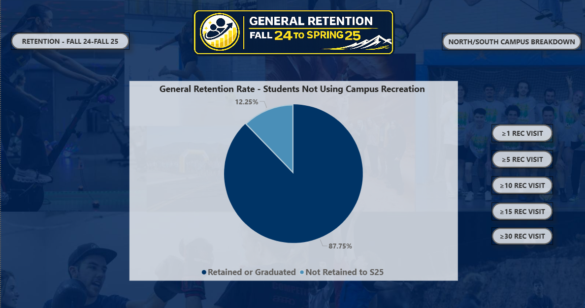
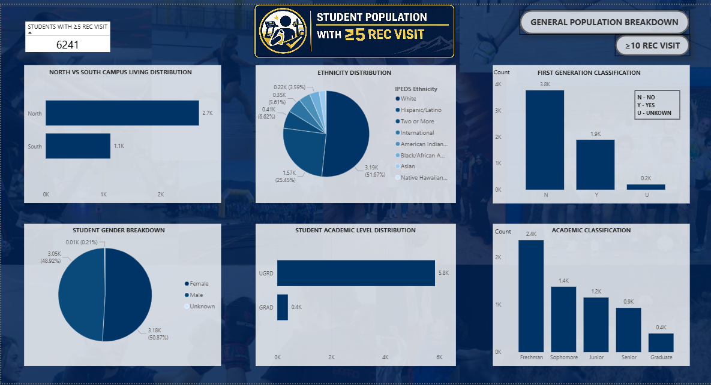
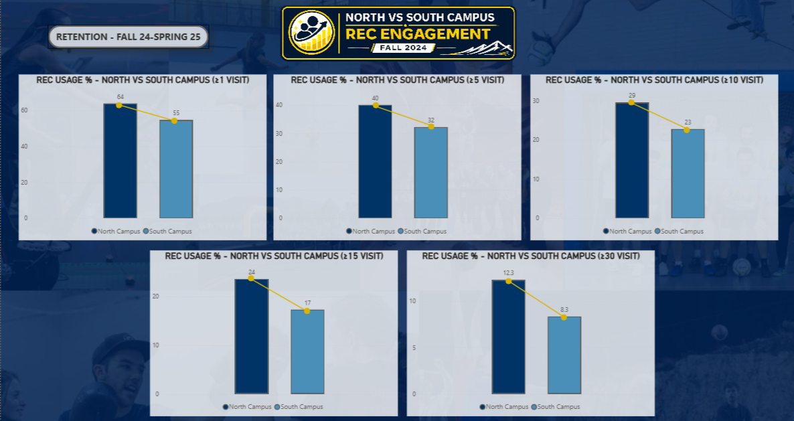

# NAU Campus Recreation — Student Retention Dashboard

> **Power BI product analyzing campus recreation engagement's impact on student retention across 20,941 NAU students. In production use at Northern Arizona University.**

---


---

## The Headline Finding

| Cohort | Retention Rate | Delta |
|--------|---------------|-------|
| Students with **0** rec visits | 59.0% | — |
| Students with **≥1** rec visit | 71.8% | **+12.1pp ↑** |
| Students with **≥5** rec visits | 71.8% | +12.8pp ↑ |
| Students with **≥30** rec visits | 70.4% | +11.4pp ↑ |

> ⚠️ **Association, not causation.** Potential confounders (GPA, socioeconomic status, prior-year engagement, residency) were not controlled. The +12.1pp figure reflects correlation, not a proven causal mechanism.

---

## The Problem

NAU Campus Recreation leadership needed to answer a board-level question:

> *"Does using the rec facility improve student retention — and if so, which students, by how much, and does it matter how often they visit?"*

Extending the analysis to answer this in a self-service format — sliceable by visit threshold, campus, and demographics — required building a data product, not just pulling a number.

**Constraints:**
- Non-technical staff needed to explore it without a data analyst in the room
- Results needed to be reproducible each semester
- Stakeholder requested specific engagement buckets: ≥1, ≥5, ≥10, ≥15, ≥30 visits

---

## My Role

Built end-to-end as a Business/Product Analyst at NAU Campus Rec:

- Translated the director's business questions into a **3-table star schema**
- Authored all **16 DAX measures** from scratch
- Designed the **visit-threshold bucketing logic**
- Built **20+ navigable pages** with cross-filtering, bookmarks, and drill-through
- Delivered documentation + a staff walkthrough for handoff
- Surfaced the **0→1 insight** (see below) that redirected outreach strategy

---

## Dashboard Screenshots

### General Retention — F24 to S25 (≥1 Rec Visit)

*91.82% retention rate for students with at least one rec visit, vs. 87.75% for non-users (Fall 24 → Spring 25 cohort)*

### Demographic Breakdown — Bucket 5 (≥5 Rec Visits)

*Cross-filtering by ethnicity, gender, first-gen status, and academic level. Engagement effect holds across all demographic segments.*

### North vs South Campus — Rec Engagement Comparison

*North Campus students engage at 64% vs South Campus at 55% across all visit thresholds — key input for a proposed South Campus facility expansion.*

---

## The Insight I Surfaced

The director requested engagement buckets (≥1, ≥5, ≥10, ≥15, ≥30 visits). When I pulled the numbers, the pattern was clear:

```
No visits:    59.0%  ████████████░░░░
≥1 visit:     71.1%  █████████████████░░░  ← +12.1pp jump here
≥5 visits:    71.8%  █████████████████░░░
≥10 visits:   71.3%  █████████████████░░░
≥15 visits:   71.1%  █████████████████░░░
≥30 visits:   70.4%  █████████████████░░░
```

**The lift is almost entirely at the 0→1 transition.** Above 5 visits, returns are flat — statistically noise.

I raised this in stakeholder review. Leadership used it to **shift the outreach strategy from a visit-frequency campaign to a first-visit campaign** for non-engaged students. The original buckets stayed in the dashboard; the framing of how staff talk about the data changed.

---

## Key Segmentation Findings

| Segment | Finding |
|---------|---------|
| **North Campus residents** | 75.6% retention |
| **South Campus residents** | 72.7% retention |
| **Non-residents** | 56.5% retention |
| **Non-First-Gen students** | 68.8% retention |
| **First-Gen students** | 64.4% retention — 4.4pp gap narrowed by rec engagement |
| **⚠️ "Unknown" FGen status** | **31.8% retention** — 519 students, flagged as data-quality issue + outreach risk |

The Unknown-FGen outlier was escalated separately: both a data-quality problem (missing intake field) and a retention risk (population being missed by all outreach campaigns).

---

## What Leadership Did With It

1. **Redirected outreach dollars** from frequent-user campaigns toward a first-visit acquisition campaign for non-engaged students
2. **Prioritized FGen and Unknown-FGen cohorts** for targeted outreach — closes the retention gap and fixes the data-quality issue in parallel
3. **Fed the North/South comparison** into a proposal for expanded rec facilities on South Campus
4. **Adopted the dashboard for weekly retention monitoring** — now used by Campus Rec staff each semester

---

## Data Model

Three-table star schema:

```
F24-S25 Retention (fact)          F24-F25 Retention (fact)
├── *Emplid (student ID)          ├── *Emplid (student ID)
├── Retained or Graduated         ├── Retained or Graduated
├── Visit bucket flags            ├── Visit bucket flags
│   (≥1, ≥5, ≥10, ≥15, ≥30)     │   (≥1, ≥5, ≥10, ≥15, ≥30)
├── Ethnicity (IPEDS)             ├── Ethnicity (IPEDS)
├── Sex                           ├── Sex
├── First-Gen classification      ├── First-Gen classification
├── Academic level                ├── Academic level
└── Campus (North/South)         └── Campus (North/South)
                  │
                  └──── Campus (dimension)
                         ├── Campus name
                         └── Building-to-campus mapping
```

**Relationships:** Single-direction. No bidirectional cross-filters (avoids ambiguity in DAX context).

Full field descriptions → [`data/data_dictionary.md`](data/data_dictionary.md)

---

## DAX Highlights

See all 16 measures → [`dax/measures.md`](dax/measures.md)

```dax
// Distinct student count — anchors all retention rate calculations
Retention Total = DISTINCTCOUNT('F24-F25 Retention'[*Emplid])

// Retained-or-graduated count for bucket analysis
Count of Retained or Graduated for 1 =
CALCULATE(
    COUNTA('F24-F25 Retention'[Retained or Graduated]),
    'F24-F25 Retention'[Retained or Graduated] IN { 1 }
)

// North campus retention percentage
Percentage North F24 =
DIVIDE(
    [Count of *Emplid for North],
    [Count of NAU ID for North],
    0
) * 100
```

---

## Report Structure

20+ pages organized into three navigable sections:

| Section | Pages | Purpose |
|---------|-------|---------|
| **General Breakdown** | 2 (F24, F24-S25) | Demographic overview by engagement bucket |
| **Bucket Retention** | 10 (5 buckets × 2 time horizons) | Retention rate at each visit threshold |
| **Geographic Analysis** | 1 | North vs South campus engagement comparison |
| **Overview Buttons** | 1 | Navigation landing page |

All pages cross-filter. Slicers and bookmarks allow non-technical staff to pivot between views without training.

---

## How It Shipped

| | |
|--|--|
| **Status** | In production use at NAU Campus Rec |
| **Cadence** | Refreshed each semester since Fall 2024 |
| **Used by** | Campus Rec leadership, referenced in monthly briefings |
| **Artifacts** | Full .pbix + DAX measure library available on request |

> The .pbix file is not included in this repo — it contains student-level enrollment data protected under FERPA. Contact me directly if you'd like a walkthrough or demo.

---

## Tech Stack

- **Power BI Desktop** — report authoring, DAX, data modeling
- **Power Query (M)** — ETL, data type normalization, column transformations
- **DAX** — 16 calculated measures across 2 fact tables
- **Excel / CSV** — source data formats (institutional enrollment exports)

---

## About

Built by **Rohith Reddy Thumma** — Product Analyst, MS Business Analytics @ NAU (GPA 4.0, Distinction, May 2026).

- 🌐 Portfolio: [veritas-ui-eight.vercel.app](https://veritas-ui-eight.vercel.app)
- 💼 LinkedIn: [linkedin.com/in/rohithreddythumma](https://linkedin.com/in/rohithreddythumma)
- 📧 rohiththumma2001@gmail.com

---

*This dashboard is one of four projects in my portfolio. Others include a 1st-place transit analytics capstone (Mountain Line), a deployed RAG chatbot (Veritas AI), and an AI-powered document automation pipeline (Pinnacle).*
