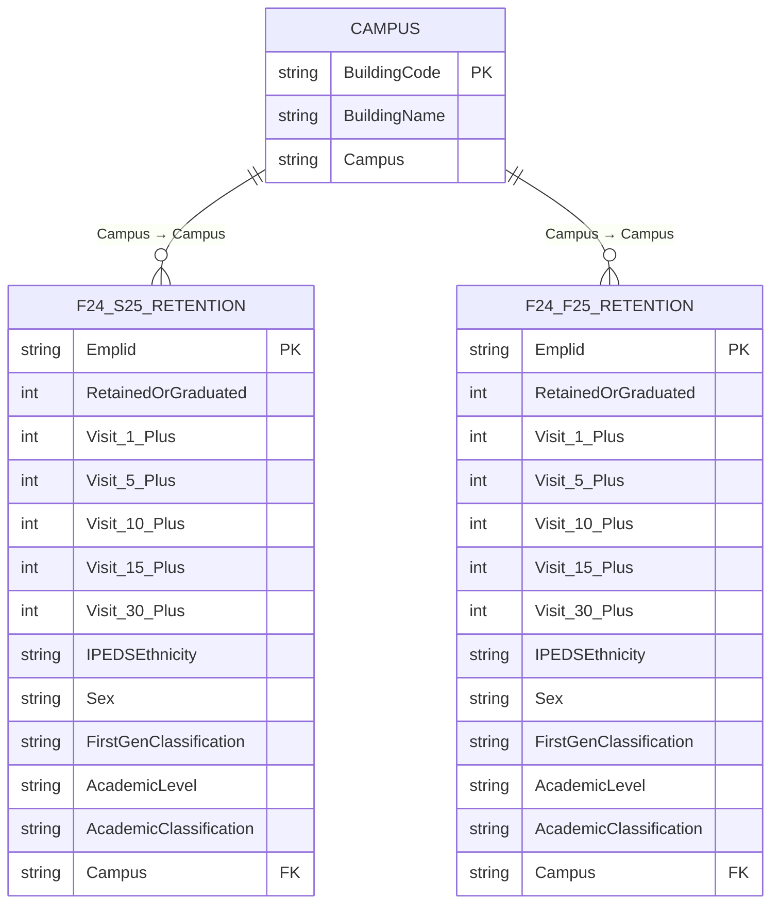

# Data Model - NAU Retention Dashboard

## Overview

The dashboard uses a **star-style schema** with two fact tables and one dimension table. Both fact tables share the same field structure but measure retention across different time horizons (Fall→Spring vs. Fall→Fall).

---

## Entity Relationship Diagram

---

## Table Descriptions

### F24-S25 Retention (Fact)
- **Grain:** One row per student in the Fall 2024 cohort
- **Measures:** Whether the student returned for Spring 2025
- **Use:** Short-term retention analysis (semester-over-semester)
- **Rows:** ~20,941

### F24-F25 Retention (Fact)
- **Grain:** One row per student in the Fall 2024 cohort
- **Measures:** Whether the student returned for Fall 2025
- **Use:** Year-over-year retention analysis
- **Rows:** ~20,941

### Campus (Dimension)
- **Grain:** One row per NAU building
- **Purpose:** Maps student housing building codes to North or South campus
- **Rows:** ~200

---

## Relationships

| From | To | Type | Direction | Cardinality |
|------|----|------|-----------|-------------|
| `Campus[BuildingCode]` | `F24-S25 Retention[Campus]` | Active | Single (Campus → Fact) | One-to-Many |
| `Campus[BuildingCode]` | `F24-F25 Retention[Campus]` | Active | Single (Campus → Fact) | One-to-Many |

### Why Single-Direction Only

Bidirectional cross-filter was tested and **caused ambiguous filter propagation** in the visit-bucket DAX measures. Specifically, filtering one fact table would bleed through the Campus dimension into the other fact table, producing incorrect totals on pages that display both retention horizons. Single-direction relationships eliminate the ambiguity: Campus filters both facts, but the facts cannot filter each other through the dimension.

---

## Design Decisions

### Why Two Separate Fact Tables (Not One)

The two time horizons (F→S and F→F) have different retention outcome fields. Rather than adding a horizon parameter to a single table (which would require complex DAX SWITCH logic in every measure), two clean tables with identical schemas were loaded separately. Each table's page set uses its own measures, keeping DAX simple and readable.

### Why Pre-Computed Visit Flags

The source data provided raw visit counts. Rather than computing `Visit >= 1`, `Visit >= 5` etc. in DAX at query time, these were pre-computed as binary flags (0/1) in Power Query. This:
- Reduces DAX complexity (CALCULATE + flag = 1 rather than CALCULATE + count >= N)
- Improves visual rendering speed on pages with many cross-filters active
- Makes the logic auditable — anyone can see the flags in the data view

### Why DISTINCTCOUNT on Student ID

Source exports contain one row per student-enrollment-event, not one row per student. A student with two majors or a mid-semester major change could appear twice. DISTINCTCOUNT on `*Emplid` ensures correct student headcounts regardless of enrollment record multiplicity.

---

## Power Query Transformations

Transformations applied before loading into the model:

1. **Promoted headers** - first row of each CSV promoted to column names
2. **Data type enforcement** - `Retained or Graduated` and all visit flags cast to Integer; `*Emplid` cast to Text to prevent numeric rounding on long IDs
3. **Visit flag computation** - `Visit_N_Plus` columns derived from raw visit count column using `if [VisitCount] >= N then 1 else 0`
4. **Campus mapping join** - `Campus` column derived by merging on building code against the Campus dimension table
5. **Null handling** - null `FirstGenClassification` values mapped to `"U"` (Unknown) for consistent filtering
6. **Removed duplicates** - duplicate Emplid rows removed after confirming they were data-entry artifacts, not legitimate multi-enrollment records

---

## Performance Notes

- Both fact tables load fully into Vertipaq (in-memory columnar store) - no DirectQuery
- With ~20,941 rows each and ~15 columns, memory footprint is minimal (<5MB compressed)
- All measures use DIVIDE with a 0 fallback to prevent blank visual errors on filtered subsets with zero denominators
- No calculated columns were added to fact tables post-load — all aggregations are measures
